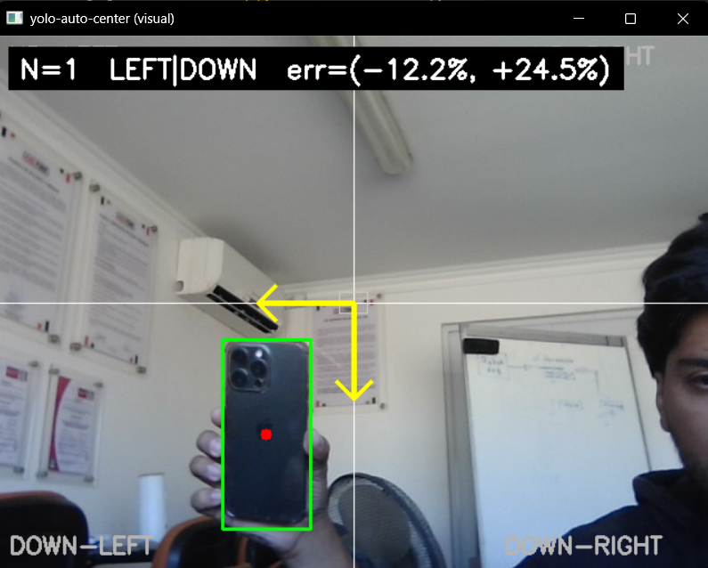

# YOLO Auto Center

Real-time object auto-centering module built on YOLO.

Provides directional alignment feedback to center a detected object within the image frame. Designed as a perception-only component for integration into robotic and vision-based control systems.

---

## Overview

YOLO Auto Center processes a video stream, detects objects using YOLO, and computes the corrective direction required to align the object centroid with the image center.

The module does **not** control hardware directly. It outputs alignment information that can be consumed by external control systems such as:

- PID controllers  
- Gimbal drivers  
- Robot motion controllers  
- Visual servoing loops  

---

## Example Output

### Static Example



### Dynamic Example


### Visual Legend

- White cross — Image center  
- Red dot — Object centroid  
- Green box — Detection bounding box  
- Yellow arrows — Corrective motion direction  

---

## System I/O

### Input

Configured via:

```
config/default.yaml
```

**Parameters**

`source`  
- `"0"` — Webcam  
- `"rtsp://..."` — RTSP stream  
- `"video.mp4"` — Video file  

`model_path`  
- `"yolov8n.pt"` — Automatically downloaded on first run  
- `"models/custom_model.pt"` — Custom trained model  

`class_id` (optional)  
- `-1` — All classes  
- Specific index — Filter detections by class  

---

### Output

For each processed frame:

```json
{
  "found": bool,
  "dir_x": "LEFT" | "RIGHT" | "OK",
  "dir_y": "UP" | "DOWN" | "OK",
  "err_x": float,
  "err_y": float,
  "n": int
}
```

**Fields**

- `dir_x`, `dir_y` — Recommended corrective motion  
- `err_x`, `err_y` — Normalized offset from image center  
- `n` — Number of detections used for centroid computation  
- `found` — Indicates whether a valid detection exists  

---

## Installation

### Clone Repository

```bash
git clone https://github.com/monke-p/yolo-auto-center.git
cd yolo-auto-center
```

---

### CPU Installation

Use this option if:

- No NVIDIA GPU is available  
- CUDA is not installed  
- Running on a CPU-only machine  

Install PyTorch CPU build:

```bash
pip install torch torchvision --index-url https://download.pytorch.org/whl/cpu
```

Then install the package:

```bash
pip install -e .
```

---

### NVIDIA GPU Installation (CUDA)

Use this option if:

- An NVIDIA GPU is available  
- CUDA drivers are installed  
- Accelerated inference is required  

Install `torch` and `torchvision` using the official selector:

https://pytorch.org/get-started/locally/

After installing PyTorch:

```bash
pip install -e .
```

---

## Running the Example

```bash
python examples/run.py
```

The example will:

- Open the configured video source  
- Run YOLO detection  
- Display bounding boxes and centroid  
- Draw image quadrants  
- Show corrective arrows  
- Print normalized alignment error  
- Display number of detections  

Press `q` to exit.

---

## Configuration

All runtime parameters are defined in:

```
config/default.yaml
```

### Example Configuration

```yaml
source: "0"
model_path: "yolov8n.pt"
class_id: -1
use_group: true
group_mode: "weighted"
```

Notes:

- Standard YOLO models (e.g., `yolov8n.pt`) are downloaded automatically on first execution.  
- Custom models must be placed inside the `models/` directory.  

---

## Integration

After installation:

```python
from yolo_auto_center import AutoCenter

ac = AutoCenter.from_config(cfg)
result = ac.process_frame(frame)
```

You can use:

```python
result["dir_x"]
result["dir_y"]
result["err_x"]
result["err_y"]
```

to drive:

- PID controllers  
- Servo drivers  
- Gimbal systems  
- Robot motion controllers  
- Visual servoing pipelines  

---

## Typical Use Cases

- Camera gimbal alignment  
- PTZ correction  
- Robot target following  
- Vision-based tracking  
- Drone camera stabilization  
- Industrial alignment systems  

---

## Architecture

```
Camera → YOLO → AutoCenter → External Controller → Actuator
```

This repository provides perception and alignment logic only.

---

## License

MIT License
